# Aplicacion con Cluster NodeJS

Esta es una aplicación que utiliza cluster para mejorar el tiempo de respuesta del servidor a los cientes que le hacen solicitudes. 
Veremos diferentes maneras de usar los cluster de NodeJS(como con PM2 por ejemplo) y como realizar pruebas para comprobar la eficiencia del servidor.

## LOGS 

## Sin cluster

### 1 solo proceso: 
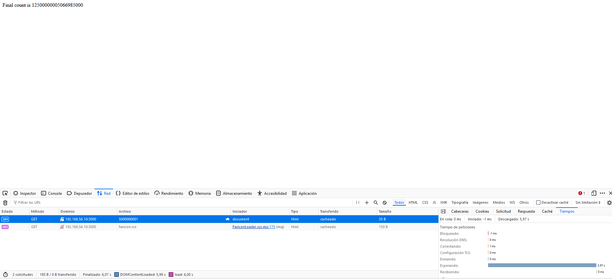

### Varios procesos sin cluster: 

1. Primer proceso:  
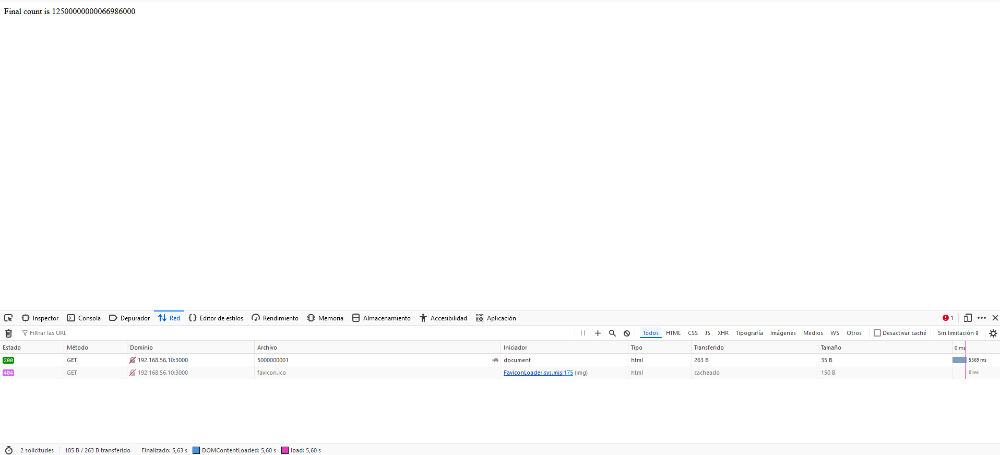

2. Segundo proceso:  
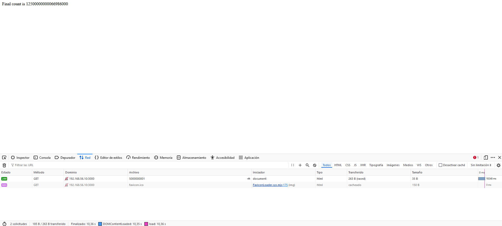

### Con Clúster 

### 1 solo proceso:  

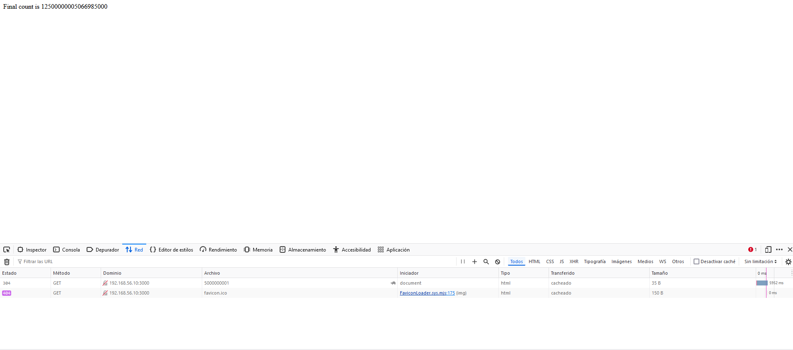

### Varios procesos sin cluster: 

1. Primer proceso:  

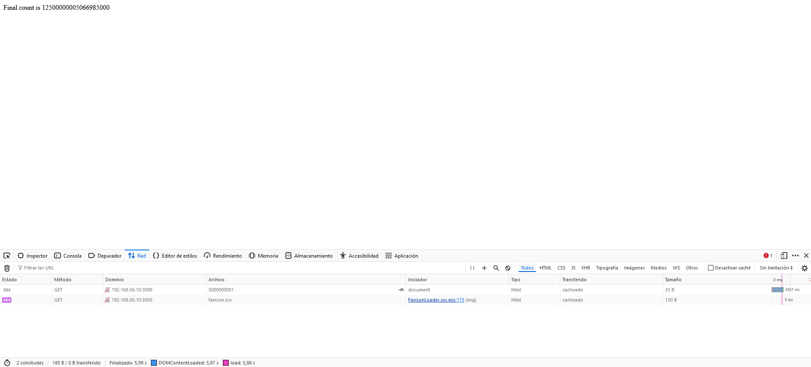

2. Segundo proceso:  

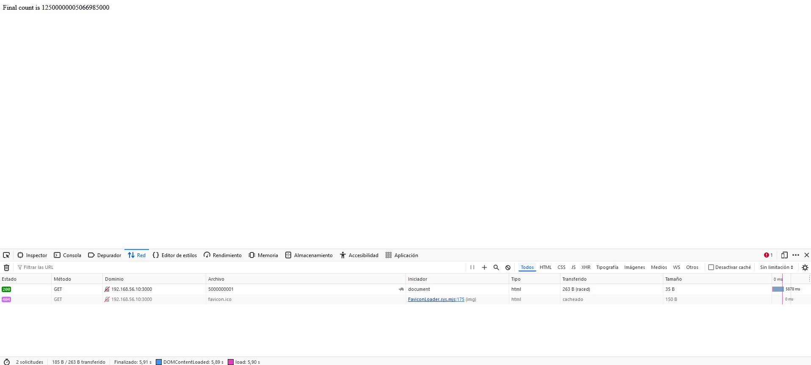

### Loadtest log: 

### Loadtest log SIN cluster y mas de 500000000 solicitudes  

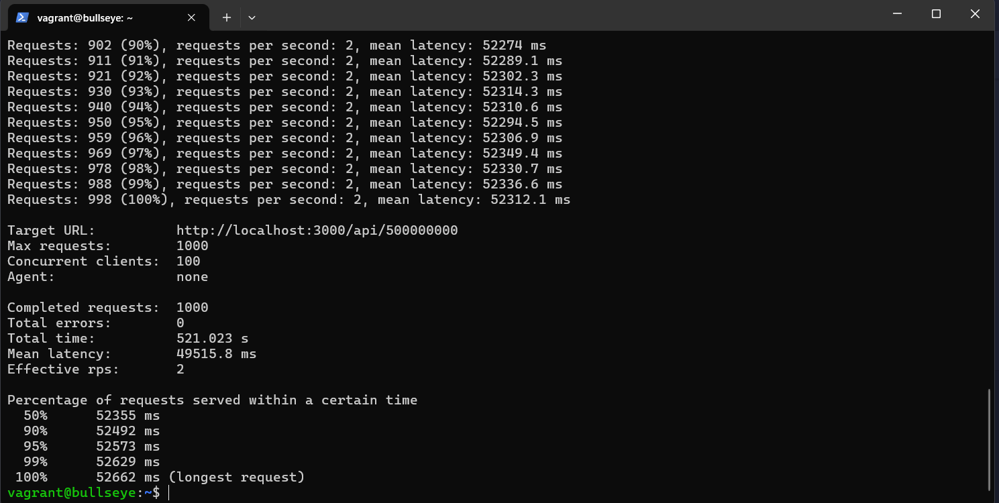

### Loadtest log con cluster y mas de 500000000 solicitudes  

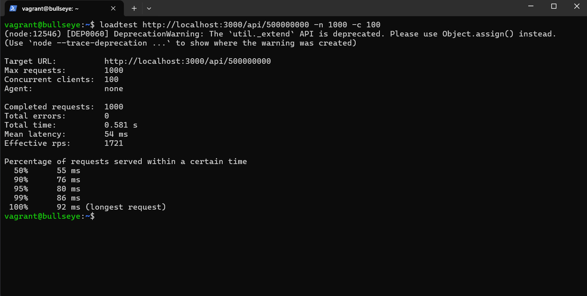

## LOGS de PM2

#### Log de la aplicacion sin cluster pero con el comando de pm2:  

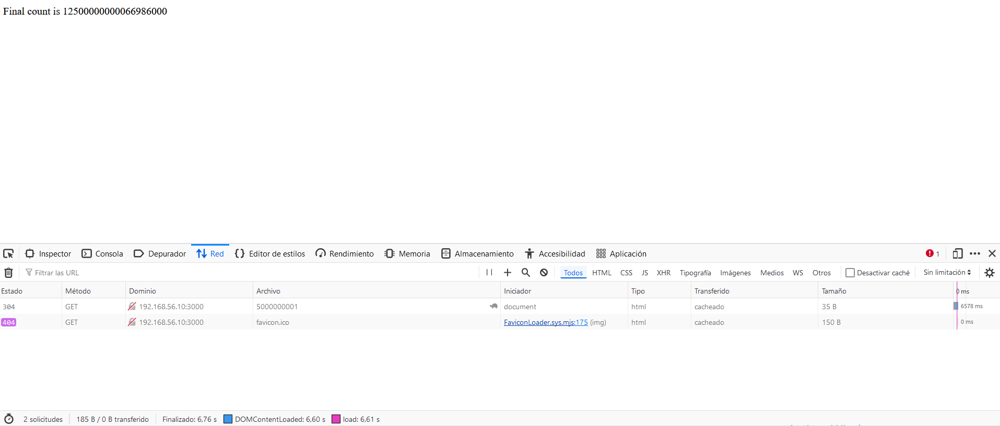

#### Log de la aplicacion sin cluster ejecutando 2 solicitudes simultaneas pero con el comando de pm2: 

1. Primer proceso:  
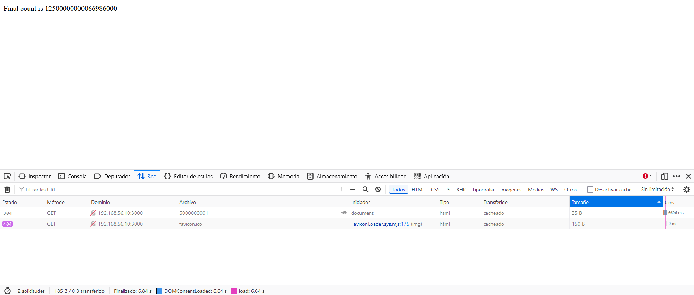

2. Segundo proceso: 
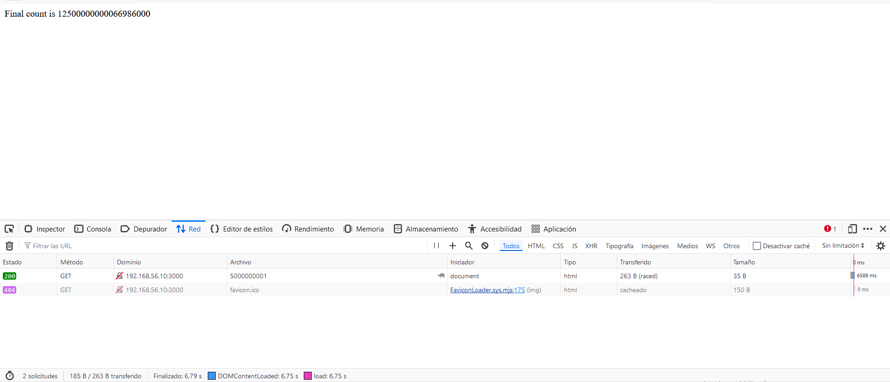

#### Log de la aplicacion sin cluster ejecutando el siguiente loadtest: loadtest http://localhost:3000/api/500000 -n 1000 -c 100  

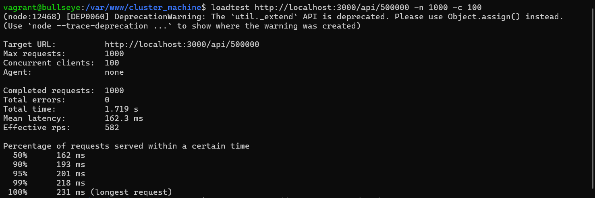

#### Log de la aplicacion sin cluster ejecutando el siguiente loadtest: loadtest http://localhost:3000/api/5000000 -n 1000 -c 100  

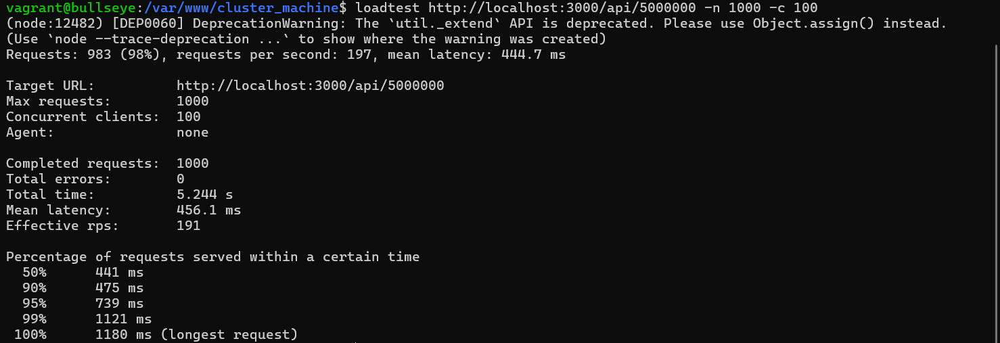

#### Log de la aplicacion con cluster solicitudes pero con el comando de pm2: 

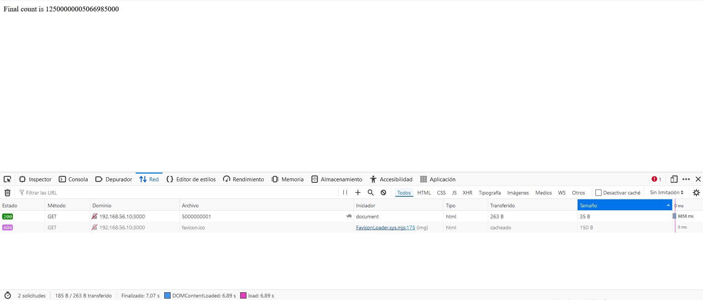

#### Log de la aplicacion con cluster  ejecutando 2 solicitudes pero con el comando de pm2:

  

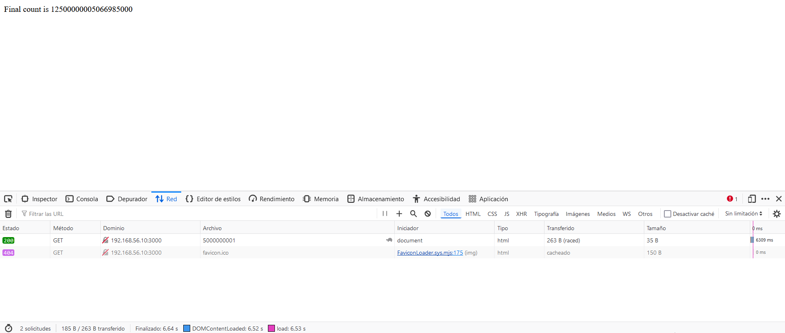

#### Log de la aplicacion con cluster ejecutando el siguiente loadtest: loadtest http://localhost:3000/api/500000 -n 1000 -c 100  

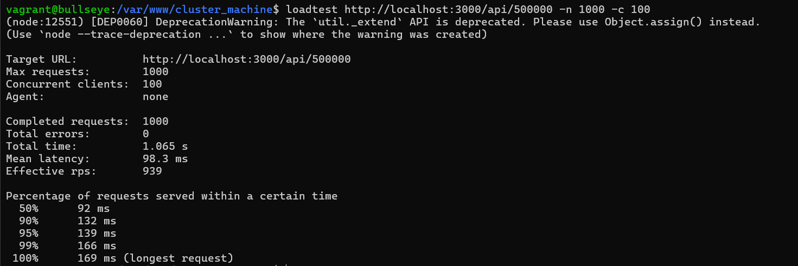

#### Log de la aplicacion con cluster ejecutando el siguiente loadtest: loadtest http://localhost:3000/api/5000000 -n 1000 -c 100  

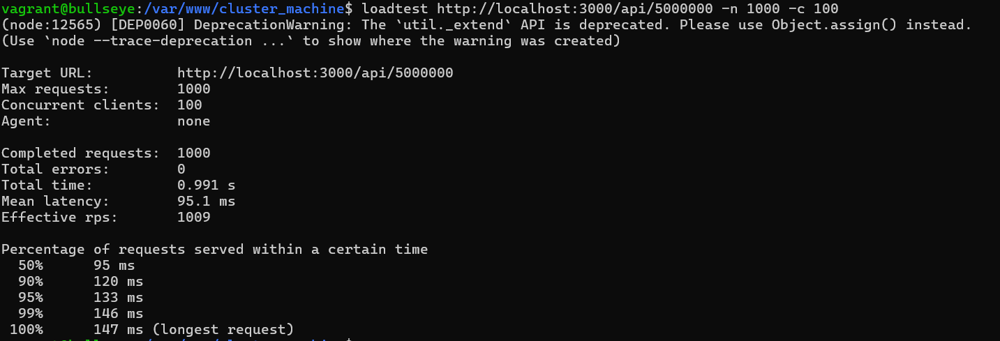

# Tarea

1. ¿Que hace pm2 ls?

    - Este comando se utiliza para listar todas las aplicaciones gestionadas por PM2. 

2. ¿Que hace pm2 logs?

    - Este comando se utiliza para ver los logs en tiempo real, es muy util para monitorear el estado del servidor y los mensajes generados por las aplicaciones en ejecución.

3. ¿Que hace pm2 monit?

    - Este comando se utiliza para mostrar un panel interactivo con métricas en tiempo real de las aplicaciones gestionadas por PM2. Proporciona información sobre el uso de CPU, memoria, logs y otros detalles útiles para monitorear el rendimiento del servidor.

    - Log de ejemplo sacado de la documentacion oficial de pm2: 

### Respuesta a la pregunta: ¿Sabrías decir por qué en algunos casos concretos, como este, la aplicación sin clusterizar tiene mejores resultados?

Pues esto puede ser debido a que a veces podemos tener mas workers de los que la CPU puede soportar, entonces si tenemos varios workers compitiendo por la misma CPU eso puede reducir bastante su velocidad. 
